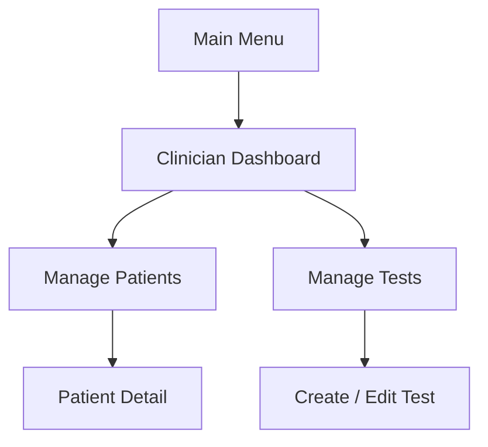

# ReSound — Wireframe spec + implementation plan

## Overall structure (two modes)

| Mode | Purpose |
|------|--------|
| **Patient flow** | Take hearing test, history, results |
| **Clinician flow** | Dashboard → manage patients & tests, create/edit tests |

**Demo line (for presentations):** The clinician interface is a structured workflow: clinicians manage patients and configure hearing tests through simple, step-by-step interactions while staying consistent with the patient interface.

---

## Patient flow (target vs codebase)

**Target journey:** Main Menu → Select Environment (grid) → **Select Difficulty** → Hearing Test (no timer; Pause/Continue) → MCQ → Result (with bar) → View History.

**Rules:** No timer; Pause/Continue; exit **top-left only**; grid selection (no dropdown); simple UI; no clutter.

**Current code ([EntryPoint.swift](ReSound/App/EntryPoint.swift), [HearingTestScene.swift](ReSound/Views/HearingTestScene.swift)):**

- Main menu + environment grid exist; difficulty is **not** a separate step (difficulty is folded into clinician `CustomTest.Positioning`, not patient preset picker).
- No countdown timer in code (aligned).
- **Pause/Continue:** `waiting` state has Continue; there is no explicit **Pause** during `playing` — needs design (button + state).
- **Exit:** `startView()` uses bottom “Exit” with `.tint(Color.red)` — conflicts with spec (no red; exit top-left).
- **Result:** score text only; **no bar** yet.
- **View History:** main menu button is a stub.

**Selection styling:** [EntryPoint.swift](ReSound/App/EntryPoint.swift) uses `Color.green` for selected preset — replace with **NAL Blue** / unselected grey per global rules.

---

## Clinician flow (target navigation)



**Current code ([ClinicianScene.swift](ReSound/Views/ClinicianScene.swift)):** `ClinicianState` is `begin | edit | add` with list + `updateView()` — not yet a explicit **dashboard** with `[Manage Patients]` / `[Manage Tests]` or patient entities.

---

## Screen specs (clinician)

### 1. Clinician dashboard

- **Purpose:** Navigation hub only.
- **Actions:** `[Manage Patients]` `[Manage Tests]`.

### 2. Manage patients

- List + search + add patient.
- **PatientRow:** name, last test date → tap → Patient detail.

### 3. Patient detail

- Test history list; scores; optional performance bar.
- **TestItem:** environment, score (e.g. 3/4), date.

### 4. Manage tests

- List test suites; **environment grid** (reuse patient-style grid component); add new test.
- Tap row → Edit test.

### 5. Create / edit test (highest priority)

**Form fields:**

- Test name — `TextField`
- Environment — `LazyVGrid` of buttons (Home / Cafe / Train align with [CustomTest.Theme](ReSound/Models/CustomTest.swift))
- Difficulty — `HStack` Easy / Medium / Hard → maps to `CustomTest.Positioning`
- Number of questions — `Stepper` in `1...10` (or cap consistent with `CustomTest` + `generateTest()`)
- Questions preview — simple list (derive from generated or template questions after `generateTest()` or summary strings)
- **Save Test** — persist via existing [PersistStorage](ReSound/Models/PersistStorage.swift) patterns (extend as needed)
- **Preview Test** — open existing `HearingTestScene` with `hearingTest` from `customTest.generateTest()` (already used in clinician flow)

---

## Model alignment (important)

Wireframe **Test** struct:

```swift
struct Test {
    var name: String
    var environment: String
    var difficulty: String
    var questionCount: Int
}
```

**Do not duplicate** the full test pipeline: [CustomTest](ReSound/Models/CustomTest.swift) already holds `name`, `Theme` (environment), `Positioning` (difficulty), `numberOfQuestions`, and `generateTest() -> HearingTest`.

**Recommended approach:**

- Use **`CustomTest` as the source of truth** in the Create/Edit ViewModel.
- Expose **display strings** for environment/difficulty in the VM, or add a thin presentation layer—avoid a parallel `Test` type that drifts from `CustomTest` unless it is a typealias or wraps it for UI-only binding.

Optional: `typealias` or nested `struct ClinicalTestDraft: Codable` that mirrors wireframe and converts to/from `CustomTest` for persistence.

---

## UI rules (consistency)

| Do | Don’t |
|----|--------|
| Glass background (blur), centered panel | Clutter, random layout |
| Rounded buttons; shared spacing constants | Red/green accent colours (remove `Color.red` exit, `Color.green` selection) |
| Default selection → grey; selected → **NAL Blue** | Timer in patient test |
| Minimal layout | — |

**Implementation:** Define `Color.nalBlue` (or asset catalog colour) once in a small theme file or extension; use for `.tint` / borders on selected grid cells and primary actions as needed. **Source:** you will add the exact NAL Blue asset or hex to the project (not a temporary system-blue placeholder).

---

## Logic notes

- **Save test:** local array + existing persistence layer; Core Data only if product later requires it.
- **Patients:** dummy data acceptable for demo.
- **History:** reuse same list components between patient “view history” and clinician patient detail where possible.

---

## MVVM shape (SwiftUI)

- One **Observable** ViewModel per heavy screen (e.g. `CreateEditTestViewModel` holding `CustomTest`, save/preview actions).
- Views remain dumb: `TextField`, `LazyVGrid`, `Stepper` bound to VM.
- Navigation: `NavigationStack` + enums for clinician subtree (matches wireframe map).

---

## Implementation order (confirmed)

1. **Create/Edit Test** — form + VM + Save/Preview + `CustomTest`/`HearingTest` wiring.
2. **Manage Tests** — list + navigation to Create/Edit; reuse environment grid component.
3. **Patient list** — search, add, rows (dummy data).
4. **Patient detail** — history list + scores (+ optional bar).
5. **Navigation** — dashboard hub + stack linking all clinician routes.
6. **Patient flow polish** — difficulty screen if required by wireframes, pause/continue, result bar, top-left exit, history stub, remove forbidden colours.

---

## Key files to touch

| Area | Files |
|------|--------|
| Clinician UI | [ClinicianScene.swift](ReSound/Views/ClinicianScene.swift) (split into smaller views as needed) |
| New views | e.g. `ClinicianDashboardView`, `ManagePatientsView`, `PatientDetailView`, `CreateEditTestView` (under `ReSound/Views/` or `ReSound/Views/Clinician/`) |
| Models | [CustomTest.swift](ReSound/Models/CustomTest.swift), new `Patient` / `PatientTestRecord` if needed |
| Persistence | [PersistStorage.swift](ReSound/Models/PersistStorage.swift) |
| Patient flow | [EntryPoint.swift](ReSound/App/EntryPoint.swift), [HearingTestScene.swift](ReSound/Views/HearingTestScene.swift) |
| Theme | New small `Color+Theme.swift` or asset catalog for NAL Blue |

---

## HIG (visionOS)

Keep prior guidance: semantic typography, Dynamic Type, accessibility labels on grids/buttons, materials consistent with glass panels — see Apple visionOS HIG for window-based clinician UI.
